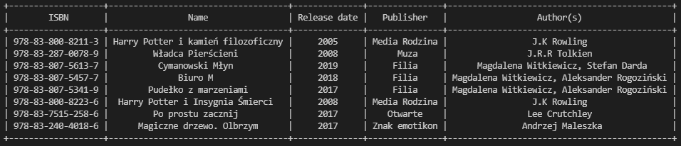

# **BOOK DATABASE**

Projekt ten imituje bazę danych książek. Użytkownik może wykonywać następujące operacje na bazie danych: wstawianie, usuwanie, wyszukiwanie, listowanie.

# Wymagania

## **Prettytable** [(link)](https://pypi.org/project/prettytable/)
Program wymaga biblioteki **prettytable** w wersji 2.5.0. Umożliwia ona wyświetlanie rekordów w przejrzystej dla oka tabeli 
Install via pip:
> python -m pip install -U prettytable

## **Sqlite3**
Dodatkowo program wymaga modułu **sqlite3**, który od pythona 2.5 jest domyślnie w bibliotece standardowej. Moduł ten wykorzystywany jest do komunikacji z bazą danych.

# Uruchomienie

Program uruchamiamy poprzez plik main.py 
Na przykład poprzez wywołanie poniższej komendy (znajdując się w folderze głównym projektu)
> python main.py

# Opis

Po uruchomieniu programu naszym oczom ukaże się menu z opcjami 1-5.
Wybieramy stosowną opcję wpisując odpowiednią liczbę oraz zatwierdzając nasz wybór klawiszem **ENTER**

## Opcja 1

Opcja ta pozwala nam dodać nową książkę do bazy danych. Po jej wybraniu jesteśmy kolejno proszeni o podanie identyfikatora ISBN książki, jej nazwy, daty wydania, wydawnictwa. Identyfikator książki musi być unikalny, dlatego też niemożliwe jest dodanie do bazy danych dwóch książek o tym samym ISBN. Na tym etapie do tabeli book dodawany jest nowy rekord. Po podaniu tych czterech podstawowych informacji, w następnym kroku program prosi nas o wybranie autora(ów), którzy napisali daną pozycję. 

Przyjąłem podejście, że jedna książka może mieć wielu autorów dlatego też w tym kroku musimy wybrać jedną z czterech dostępnych opcji wyświetlonych na ekranie. (w momencie kiedy w bazie nie ma żadnego autora program wymusza najpierw na nas dodanie jednego i następnie wyświetla nam powyższe menu)

### Opcja 1

Pozwala nam na wybranie autora(ów) z listy. Wybór dokonujemy poprzez wpisanie w terminalu odpowiedniego numeru ID autora. W przypadku, gdy do danej pozycji chcemy dodać więcej niż jednego autora to identyfikatory rozdzielamy przecinkiem. Po zatwierdzeniu program spośród **poprawnie podanych** identyfikatów dodaje do tabeli author_book odpowiednie połączenia między książką a autorem(ami). Program dopuszcza sytuację, w której przy danej książce nie będzie podanego autora (np. na wskutek błędnego podania identyfikatora przez użytkownika).

### Opcja 2

Dzięki tej opcji możemy dodać nowego autora. Program prosi nas kolejno o imię oraz nazwisko autora, któego chcemy dodać.

### Opcja 3

Umożliwia usunięcie autora z bazy. Po jej wybraniu jesteśmy proszeni o podanie identyfikatora autora, którego chcemy usunąć. Gdy program znajdzie podany identyfikator w bazie przejdzie do usunięcia autora.

### Opcja 4

Wyświetla nam listę autorów.

## Opcja 2

Pozwala nam na usunięcie książki z bazy danych. Po jej wybraniu jesteśmy proszeni o podanie identyfikata ISBN. Jeśli w bazie danych zostanie znaleziona książka o podanym identyfikatorze to zostanie ona usunięta.

## Opcja 3

Opcja ta pozwala nam na wyszukiwanie rekordów po konkretnych atrybutach. Po jej wybraniu ukazuje się nam poniższe menu, w którym jesteśmy proszeni o podanie numeru od 1-5 odpowiadającemu temu po czym chcemy szukać danej książki.

Po wybraniu tego po czym chcemy wyszukiwać program prosi nas w kolejnym kroku o podanie frazy po jakiej ma szukać rekordów. Po zatwierdzeniu listuje nam na wyjście rezultat wyszukiwań.

## Opcja 4

Opcja ta pozwala nam wylistować w przejrzystej dla oka tabelce wszystkie rekordy znajdujące się w danej chwili w bazie danych. Poniżej przykładowy output. Tabelka zawiera wszystkie informację, które były wprowadzone przy dodawaniu danej książki, czyli identyfikator ISBN, nazwę, datę wydania, wydawnictwo oraz autora(ów).

## Opcja 5

Opcja ta pozwala nam zakończyć działanie programu.